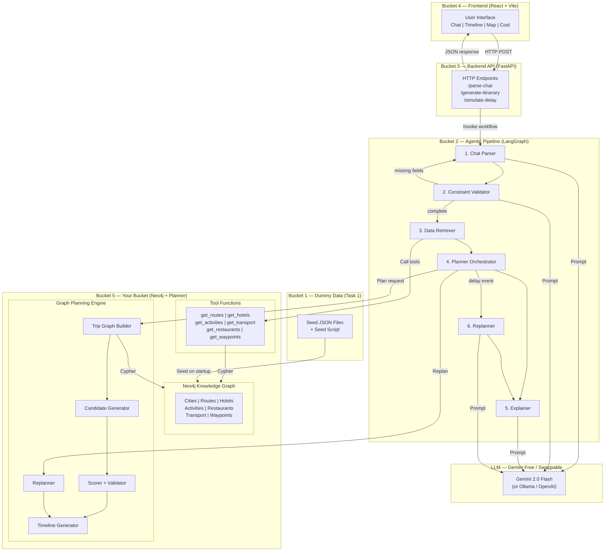
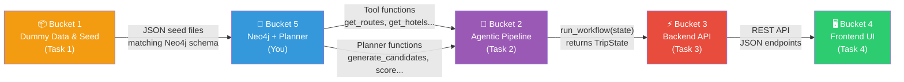
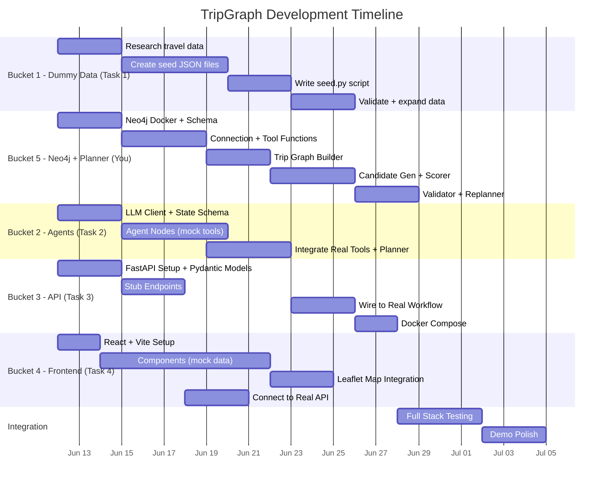

# TripGraph AI — Draft Project Plan (Revised)

## Decisions Finalized

| Decision | Choice | Rationale |
|----------|--------|-----------|
| Neo4j Scope | **Option C — Full Knowledge Graph** | All travel domain entities + relationships modeled in Neo4j |
| LLM | **Gemini Free API (swappable)** | LangChain abstraction allows hot-swapping to any model |
| Orchestration | **LangGraph** | Stateful workflow with nodes/edges matches the agent pipeline |
| Frontend | **React + Vite + Leaflet.js** | Interactive UI; extra-detailed mini-spec for the team |
| Collaboration | **Monorepo + Feature Branches** | Simplest model for teams new to GitHub collaboration |
| Evaluation | **Deprioritized** | End-to-end demo is the primary goal |
| Dummy Data Format | **JSON** (not CSV) | Mirrors real API response format for future-proofing |
| Docker | **Docker Desktop on Mac** | Required for Neo4j; runs natively on Intel + Apple Silicon |

---

## Is Option C (Full Knowledge Graph) Too Difficult?

**No — it is achievable within this scope.** Here's why:

1. **Property graph, not OWL ontology** — We're building a labeled property graph (nodes with properties, typed relationships), not a semantic web ontology with inference rules. Neo4j excels at this.
2. **Bounded domain** — Only 3 routes, ~30-40 entities total. The graph is small and manageable.
3. **Neo4j Community Edition is free** — Runs in Docker with a single command.
4. **Cypher is intuitive** — Queries read like English: `MATCH (c:City)-[:HAS_HOTEL]->(h:Hotel) WHERE h.tier = 'comfort' RETURN h`
5. **Mature Python driver** — The `neo4j` Python package is well-documented with async support.
6. **Natural fit** — Relationships like "this route connects these cities," "this hotel is near this activity," "this transport option serves this route" are fundamentally graph queries, not table lookups.

> [!TIP]
> The key advantage over JSON files: a single Cypher query can traverse multiple relationships to answer questions like *"Find all mountain destinations reachable from Gurugram that have adventure activities and comfort hotels under ₹5,000/night"* — something that would require multiple JSON file loads and manual joining in Python.

---

## Can You Build Agents on Gemini Free Tier?

**Yes.** Here's the setup:

| Component | Tool | Details |
|-----------|------|---------|
| LLM Provider | `langchain-google-genai` | `ChatGoogleGenerativeAI(model="gemini-2.0-flash")` |
| Free Tier Limits | 15 RPM, 1M TPM, 1500 RPD | Sufficient for dev + demo |
| Per Itinerary | ~6 LLM calls | Chat parse → validate → retrieve → plan → explain → (replan) |
| Latency | ~25-40 seconds total | Acceptable for demo; faster with paid tier |
| Local Alternative | Ollama + Gemma 2 9B | ~8GB RAM, no GPU needed for basic inference |
| Swapping | **One config change** | Change `provider` and `model` in `.env` file |

The LLM client abstraction ensures any model works:
```python
# backend/agents/llm_client.py — swap by changing .env
def get_llm(provider: str = "gemini", model: str = "gemini-2.0-flash"):
    if provider == "gemini":
        return ChatGoogleGenerativeAI(model=model, temperature=0)
    elif provider == "openai":
        return ChatOpenAI(model=model, temperature=0)
    elif provider == "ollama":
        return ChatOllama(model=model, temperature=0)
```

---

## The 5 Buckets (Revised)

| # | Bucket Name | Owner | Priority | Can Start On |
|---|-------------|-------|----------|-------------|
| 1 | **Dummy Data & Seed Pipeline** | Task 1 | 🔴 P0 | Day 1 |
| 2 | **Agentic AI Pipeline (LangGraph)** | Task 2 | 🟡 P1 | Day 1 (mock tools) |
| 3 | **Backend API & Integration** | Task 3 | 🟡 P1 | Day 1 (stub endpoints) |
| 4 | **Frontend UI & Visualization** | Task 4 | 🟡 P1 | Day 1 (mock API) |
| 5 | **Neo4j Knowledge Graph + Graph Planning Engine** | **You (Mainframe)** | 🔴 P0 | Day 1 |

> [!IMPORTANT]
> **All buckets can start on Day 1** because interface contracts are defined upfront. Each team works against mock/stub implementations initially, then integrates with real implementations as they become available.

---

### Bucket 1: Dummy Data & Seed Pipeline *(Task 1)*

**What it does**: Creates all the realistic dummy travel data in **JSON format that mirrors real API responses**, writes the Neo4j seed scripts, and validates data completeness.

**Why JSON not CSV?** Real APIs (Google Maps, hotel aggregators, booking platforms) return JSON. By structuring dummy data as JSON from the start, the tool functions (`get_routes`, `get_hotels`, etc.) won't need to change when swapping to real APIs later.

**Key deliverables**:
- 7 seed JSON files: cities, routes, hotels, activities, restaurants, transport options, waypoints
- Neo4j seed script (`seed.py`) that loads all JSON data into the knowledge graph
- Data validation checklist (no missing fields, consistent IDs, realistic values)
- Expanded data beyond the initial 3 routes if time allows

**Files owned**:
- `backend/data/seed_cities.json`
- `backend/data/seed_routes.json`
- `backend/data/seed_hotels.json`
- `backend/data/seed_activities.json`
- `backend/data/seed_restaurants.json`
- `backend/data/seed_transport.json`
- `backend/data/seed_waypoints.json`
- `backend/knowledge_graph/seed.py`

**Coordination**: Task 1 must align with **You (Bucket 5)** on the Neo4j schema — You define the node labels, relationship types, and property names; Task 1 creates JSON data matching that schema.

---

### Bucket 2: Agentic AI Pipeline *(Task 2)*

**What it does**: Implements the LangGraph workflow with 6 agent nodes, prompt templates, state schema, conditional edges, and the swappable LLM client.

**Key deliverables**:
- LangGraph state graph (`workflow.py`)
- TripState schema (`state.py`)
- 6 agent nodes: Chat Parser, Constraint Validator, Data Retriever, Planner Orchestrator, Explainer, Replanner
- Prompt templates for each agent
- Swappable LLM client (`llm_client.py`)

**Files owned**:
- `backend/agents/workflow.py`
- `backend/agents/state.py`
- `backend/agents/llm_client.py`
- `backend/agents/prompts.py`
- `backend/agents/nodes/chat_parser.py`
- `backend/agents/nodes/constraint_validator.py`
- `backend/agents/nodes/data_retriever.py`
- `backend/agents/nodes/planner_orchestrator.py`
- `backend/agents/nodes/explainer.py`
- `backend/agents/nodes/replanner_agent.py`

**Coordination**: Task 2 calls tool functions from **Bucket 1/5** (via defined interfaces) and planner functions from **Bucket 5**. Can start with **mock tool returns** (hardcoded dictionaries) and swap to real implementations later.

---

### Bucket 3: Backend API & Integration *(Task 3)*

**What it does**: Builds the FastAPI application that serves as the **HTTP bridge between the React frontend (JavaScript) and the Python backend (agents, planner, Neo4j)**.

> [!NOTE]
> **Why this bucket exists even with dummy data**: React runs in the browser (JavaScript). LangGraph, agents, and the planner run in Python on the server. They cannot communicate directly. FastAPI provides the HTTP endpoints that the frontend calls. Without this layer, the frontend has no way to trigger the planning pipeline.

**Key deliverables**:
- FastAPI application with CORS, error handling, and startup hooks
- 3 core endpoints: `/api/parse-chat`, `/api/generate-itinerary`, `/api/simulate-delay`
- Pydantic request/response models
- Wiring: endpoints invoke the LangGraph workflow and return structured results
- `docker-compose.yml` for running Neo4j + Backend together

**Files owned**:
- `backend/main.py`
- `backend/config.py`
- `backend/api/chat_routes.py`
- `backend/api/itinerary_routes.py`
- `backend/api/replanner_routes.py`
- `backend/models/requests.py`
- `backend/models/responses.py`
- `docker-compose.yml`
- `.env.example`

**Coordination**: Task 3 calls `run_workflow()` from **Bucket 2** and returns the result as JSON. Can start with **stub endpoints** that return hardcoded JSON responses (matching the response schema) so the frontend team can begin building immediately.

---

### Bucket 4: Frontend UI & Visualization *(Task 4)*

**What it does**: Builds the React application with all interactive panels — chat room, extracted preferences, itinerary options, timeline, Leaflet map, cost breakdown, delay simulator, and calendar view.

> [!IMPORTANT]
> This bucket gets an **extra-detailed mini-spec** since the team is less experienced with frontend JavaScript. The mini-spec includes step-by-step setup instructions, component code structure, CSS guidance, and Leaflet.js integration walkthrough.

**Key deliverables**:
- React + Vite application
- 8 components: ChatRoom, ExtractedPreferences, ItineraryOptions, ItineraryTimeline, MapView (Leaflet), CostBreakdown, DelaySimulator, CalendarView
- API client (`tripApi.js`) using Axios
- Responsive layout with polished UI
- Demo-ready flow

**Files owned**:
- `frontend/*` (entire frontend directory)

**Coordination**: Task 4 calls the REST API from **Bucket 3**. Can start with **mock JSON data** imported locally and swap to real API calls later.

---

### Bucket 5: Neo4j Knowledge Graph + Graph Planning Engine *(You — Mainframe)*

**What it does**: The **core intelligence** of TripGraph. You own the entire Neo4j knowledge graph (schema, connection, queries) AND the planning engine (candidate generation, scoring, validation, replanning). This is the intellectual heart of the project.

**Why merged**: The planner needs deep knowledge of the Neo4j schema to write efficient Cypher queries for pathfinding and data retrieval. Having one person own both eliminates coordination overhead between these tightly coupled layers.

**Key deliverables**:

*Knowledge Graph side:*
- Neo4j Docker setup and configuration
- Schema design (node labels, relationships, constraints, indexes)
- Neo4j connection manager (`connection.py`)
- Cypher query library (`queries.py`)
- Tool function interfaces (`get_routes`, `get_hotels`, `get_activities`, `get_transport_options`, `get_restaurants`, `get_waypoints`)

*Planning Engine side:*
- Trip graph builder — construct trip DAG from Neo4j data
- Candidate itinerary generator — combinatorial exploration
- Multi-objective scorer — preference match, comfort, cost, fatigue, risk
- Hard/soft constraint validator
- Timeline generator — sequential event placement
- Delay-aware replanning engine

**Files owned**:
- `backend/knowledge_graph/connection.py`
- `backend/knowledge_graph/schema.py`
- `backend/knowledge_graph/queries.py`
- `backend/tools/route_tool.py`
- `backend/tools/hotel_tool.py`
- `backend/tools/activity_tool.py`
- `backend/tools/transport_tool.py`
- `backend/tools/restaurant_tool.py`
- `backend/tools/waypoint_tool.py`
- `backend/planner/trip_graph_builder.py`
- `backend/planner/candidate_generator.py`
- `backend/planner/scorer.py`
- `backend/planner/validator.py`
- `backend/planner/timeline_generator.py`
- `backend/planner/replanner.py`

**Coordination**: You define the tool function interfaces that **Task 2 (Agents)** calls. You define the Neo4j schema that **Task 1 (Dummy Data)** populates. You are the integration point.

---

## Architecture Diagrams

### 1. Overall Architecture (Data Flow)



### 2. Bucket Connections (Team Interaction Map)



**Data Flow Summary:**
```
Task 1 creates JSON data → You seed it into Neo4j → You expose tool functions →
Task 2's agents call your tools + planner → Task 3 wraps it in HTTP endpoints →
Task 4's React UI calls the endpoints
```

### 3. Interface Contracts Between Buckets

```
┌─────────────────────────────────────────────────────────────────────┐
│  INTERFACE: Bucket 1 → Bucket 5 (Seed Data Format)                 │
├─────────────────────────────────────────────────────────────────────┤
│  Task 1 provides JSON files matching the Neo4j schema You define.  │
│  You provide a "data spec" document listing:                       │
│    - Required fields per entity type                               │
│    - Allowed values / enums                                        │
│    - Relationship expectations (e.g., every hotel needs a city)    │
│  Task 1 writes seed.py that calls Your connection.py to load data. │
└─────────────────────────────────────────────────────────────────────┘

┌─────────────────────────────────────────────────────────────────────┐
│  INTERFACE: Bucket 5 → Bucket 2 (Tool + Planner Functions)         │
├─────────────────────────────────────────────────────────────────────┤
│  Tool Functions (agents call these):                               │
│    get_routes(origin, destination_type?) → List[RouteDict]         │
│    get_hotels(destination, tier) → List[HotelDict]                 │
│    get_activities(destination, tags?) → List[ActivityDict]         │
│    get_transport_options(route_id, modes?) → List[TransportDict]   │
│    get_restaurants(destination, route_id?) → List[RestaurantDict]  │
│    get_waypoints(route_id) → List[WaypointDict]                   │
│                                                                     │
│  Planner Functions (planner orchestrator agent calls these):       │
│    generate_candidates(constraints, data) → List[ItineraryDict]   │
│    score_itinerary(itinerary, constraints) → ScoreDict             │
│    validate_itinerary(itinerary, constraints) → ValidationReport   │
│    generate_timeline(itinerary) → List[TimelineEvent]              │
│    replan_itinerary(itinerary, delay_event) → ReplanResult         │
└─────────────────────────────────────────────────────────────────────┘

┌─────────────────────────────────────────────────────────────────────┐
│  INTERFACE: Bucket 2 → Bucket 3 (Workflow Invocation)              │
├─────────────────────────────────────────────────────────────────────┤
│  run_workflow(chat_messages: List[str]) → TripState                │
│  run_replan_workflow(itinerary_id, delay_event) → TripState        │
│                                                                     │
│  TripState contains:                                               │
│    - extracted_constraints: Dict                                    │
│    - recommended_itinerary: Dict (timeline, map_points, cost)      │
│    - alternative_itineraries: List[Dict]                           │
│    - validation_report: Dict                                       │
│    - explanation: str                                               │
│    - replanned_itinerary: Optional[Dict]                           │
│    - replanning_explanation: Optional[str]                         │
└─────────────────────────────────────────────────────────────────────┘

┌─────────────────────────────────────────────────────────────────────┐
│  INTERFACE: Bucket 3 → Bucket 4 (REST API Contract)                │
├─────────────────────────────────────────────────────────────────────┤
│  POST /api/parse-chat                                              │
│    Request:  { "chat_messages": ["...", "..."] }                   │
│    Response: { "extracted_constraints": {...}, "missing_fields":[] }│
│                                                                     │
│  POST /api/generate-itinerary                                      │
│    Request:  { "constraints": {...} }                              │
│    Response: { "recommended": {...}, "alternatives": [...],        │
│               "validation_report": {...}, "explanation": "..." }   │
│                                                                     │
│  POST /api/simulate-delay                                          │
│    Request:  { "itinerary_id": "...", "delay_type": "...",         │
│               "delay_minutes": 90 }                                │
│    Response: { "updated_itinerary": {...}, "changes": [...],       │
│               "explanation": "..." }                               │
│                                                                     │
│  All responses are JSON. CORS enabled for localhost:5173.          │
└─────────────────────────────────────────────────────────────────────┘
```

---

## Neo4j Knowledge Graph Schema

### Node Labels & Properties

| Node Label | Key Properties | Description |
|------------|----------------|-------------|
| `:City` | name, type, lat, lng, description | Cities/destinations |
| `:Route` | route_id, distance_km, base_drive_minutes, risk_level, scenic_score | Predefined travel routes |
| `:Hotel` | hotel_id, name, tier, price_per_night, comfort_score, checkin_time, checkout_time, lat, lng | Accommodation |
| `:Activity` | activity_id, name, category, duration_minutes, cost_per_person, available_slots, risk_level | Things to do |
| `:Restaurant` | restaurant_id, name, meal_types, avg_cost_per_person, avg_duration_minutes | Food stops |
| `:TransportOption` | transport_id, mode, tier, cost_total, capacity, duration_minutes, night_driving_allowed, comfort_score, fatigue_score | Transport modes |
| `:Waypoint` | waypoint_id, name, type, km_from_origin, lat, lng | Intermediate stops |
| `:Tag` | name | Descriptive tags (adventure, mountains, heritage, etc.) |

### Relationships

| Relationship | From | To | Key Properties |
|-------------|------|-----|----------------|
| `ORIGIN_OF` | City | Route | — |
| `ARRIVES_AT` | Route | City | — |
| `HAS_HOTEL` | City | Hotel | — |
| `HAS_ACTIVITY` | City | Activity | — |
| `HAS_RESTAURANT` | City | Restaurant | — |
| `HAS_TRANSPORT` | Route | TransportOption | — |
| `PASSES_THROUGH` | Route | Waypoint | order, km_from_origin |
| `TAGGED` | Activity / Restaurant / City | Tag | — |
| `NEAR` | Hotel | Activity | distance_km |
| `ON_ROUTE` | Restaurant | Route | km_from_origin (for highway stops) |

### Example Cypher Queries
```cypher
-- Find all comfort hotels in mountain destinations reachable from Gurugram
MATCH (origin:City {name: "Gurugram"})-[:ORIGIN_OF]->(r:Route)-[:ARRIVES_AT]->(dest:City)
WHERE dest.type = "mountains"
MATCH (dest)-[:HAS_HOTEL]->(h:Hotel {tier: "comfort"})
RETURN dest.name, h.name, h.price_per_night, r.distance_km
ORDER BY h.price_per_night ASC

-- Find all activities tagged 'adventure' at a destination
MATCH (dest:City {name: "Rishikesh"})-[:HAS_ACTIVITY]->(a:Activity)-[:TAGGED]->(t:Tag {name: "adventure"})
RETURN a.name, a.cost_per_person, a.duration_minutes

-- Full route data: city + hotels + activities + transport
MATCH (origin:City {name: "Gurugram"})-[:ORIGIN_OF]->(r:Route)-[:ARRIVES_AT]->(dest:City)
OPTIONAL MATCH (dest)-[:HAS_HOTEL]->(h:Hotel)
OPTIONAL MATCH (dest)-[:HAS_ACTIVITY]->(a:Activity)
OPTIONAL MATCH (r)-[:HAS_TRANSPORT]->(t:TransportOption)
RETURN r, dest, collect(DISTINCT h) as hotels, collect(DISTINCT a) as activities, collect(DISTINCT t) as transport
```

---

## GitHub Collaboration Model

### Monorepo + Feature Branches

```
Main branch (protected) ← You (Mainframe) review and merge all PRs
     │
     ├── bucket-1/seed-cities-routes      ← Task 1 branches
     ├── bucket-1/seed-hotels-activities
     ├── bucket-1/seed-script
     │
     ├── bucket-2/llm-client              ← Task 2 branches
     ├── bucket-2/langgraph-workflow
     ├── bucket-2/agent-nodes
     │
     ├── bucket-3/fastapi-setup           ← Task 3 branches
     ├── bucket-3/api-endpoints
     ├── bucket-3/docker-compose
     │
     ├── bucket-4/react-setup             ← Task 4 branches
     ├── bucket-4/chat-component
     ├── bucket-4/map-leaflet
     │
     └── bucket-5/neo4j-schema            ← Your branches
         bucket-5/tool-functions
         bucket-5/planner-engine
```

### Rules for the Team
1. **Never push directly to `main`** — always create a branch and open a Pull Request.
2. **Branch naming**: `bucket-N/short-description` (e.g., `bucket-1/seed-hotels`).
3. **Small, focused PRs** — one feature per PR, easier to review and merge.
4. **You (Mainframe) review and merge** all PRs to maintain integration quality.
5. **Pull `main` before creating new branches** — `git pull origin main` first.
6. **`.env` files are never committed** — use `.env.example` as a template.

### Setup for Team Members
```bash
# Clone the repo
git clone https://github.com/uzzidamn/TripGraph.git
cd TripGraph

# Create a branch for your task
git checkout -b bucket-N/your-task

# Work on your files, then commit and push
git add .
git commit -m "Bucket N: description of change"
git push origin bucket-N/your-task

# Open a Pull Request on GitHub for review
```

---

## Directory Structure

```
TripGraph/
│
├── backend/
│   ├── main.py                              # FastAPI entry point          [Bucket 3]
│   ├── config.py                            # Env config (Neo4j, LLM)     [Bucket 3]
│   ├── requirements.txt                     # Python dependencies          [Shared]
│   │
│   ├── api/                                 #                              [Bucket 3]
│   │   ├── __init__.py
│   │   ├── chat_routes.py                   # POST /api/parse-chat
│   │   ├── itinerary_routes.py              # POST /api/generate-itinerary
│   │   └── replanner_routes.py              # POST /api/simulate-delay
│   │
│   ├── models/                              #                              [Bucket 3]
│   │   ├── __init__.py
│   │   ├── requests.py                      # Pydantic request schemas
│   │   └── responses.py                     # Pydantic response schemas
│   │
│   ├── agents/                              #                              [Bucket 2]
│   │   ├── __init__.py
│   │   ├── workflow.py                      # LangGraph state graph
│   │   ├── state.py                         # TripState TypedDict
│   │   ├── llm_client.py                    # Swappable LLM factory
│   │   ├── prompts.py                       # Prompt templates
│   │   └── nodes/
│   │       ├── __init__.py
│   │       ├── chat_parser.py               # Chat Understanding Agent
│   │       ├── constraint_validator.py      # Constraint Validation Agent
│   │       ├── data_retriever.py            # Data Retrieval Agent
│   │       ├── planner_orchestrator.py      # Planning Orchestration Agent
│   │       ├── explainer.py                 # Explanation Agent
│   │       └── replanner_agent.py           # Replanning Agent
│   │
│   ├── knowledge_graph/                     #                              [Bucket 5 — You]
│   │   ├── __init__.py
│   │   ├── connection.py                    # Neo4j driver singleton
│   │   ├── schema.py                        # CREATE constraints/indexes
│   │   └── queries.py                       # Reusable Cypher query library
│   │
│   ├── tools/                               #                              [Bucket 5 — You]
│   │   ├── __init__.py
│   │   ├── route_tool.py                    # get_routes()
│   │   ├── hotel_tool.py                    # get_hotels()
│   │   ├── activity_tool.py                 # get_activities()
│   │   ├── transport_tool.py                # get_transport_options()
│   │   ├── restaurant_tool.py               # get_restaurants()
│   │   └── waypoint_tool.py                 # get_waypoints()
│   │
│   ├── planner/                             #                              [Bucket 5 — You]
│   │   ├── __init__.py
│   │   ├── trip_graph_builder.py            # Build trip DAG from Neo4j
│   │   ├── candidate_generator.py           # Generate candidate itineraries
│   │   ├── scorer.py                        # Multi-objective scoring
│   │   ├── validator.py                     # Hard/soft constraint checking
│   │   ├── timeline_generator.py            # Sequential event placement
│   │   └── replanner.py                     # Delay-aware replanning
│   │
│   └── data/                                # Seed data JSON files         [Bucket 1]
│       ├── seed_cities.json
│       ├── seed_routes.json
│       ├── seed_hotels.json
│       ├── seed_activities.json
│       ├── seed_restaurants.json
│       ├── seed_transport.json
│       └── seed_waypoints.json
│
├── frontend/                                #                              [Bucket 4]
│   ├── package.json
│   ├── vite.config.js
│   ├── index.html
│   ├── public/
│   └── src/
│       ├── main.jsx                         # React entry point
│       ├── App.jsx                          # Root component + routing
│       ├── index.css                        # Global styles
│       ├── api/
│       │   └── tripApi.js                   # Axios API client
│       ├── components/
│       │   ├── layout/
│       │   │   ├── Header.jsx
│       │   │   └── AppLayout.jsx
│       │   ├── chat/
│       │   │   ├── ChatRoom.jsx
│       │   │   └── ChatMessage.jsx
│       │   ├── preferences/
│       │   │   └── ExtractedPreferences.jsx
│       │   ├── itinerary/
│       │   │   ├── ItineraryOptions.jsx
│       │   │   ├── ItineraryTimeline.jsx
│       │   │   └── CalendarView.jsx
│       │   ├── map/
│       │   │   └── MapView.jsx
│       │   ├── cost/
│       │   │   └── CostBreakdown.jsx
│       │   └── delay/
│       │       └── DelaySimulator.jsx
│       └── hooks/
│           └── useItinerary.js              # Custom hook for API state
│
├── specs/                                   # Project documentation
│   ├── MASTER_SPEC.md                       # Full project specification
│   ├── bucket_1_dummy_data.md               # Mini-spec for Task 1
│   ├── bucket_2_agentic_pipeline.md         # Mini-spec for Task 2
│   ├── bucket_3_backend_api.md              # Mini-spec for Task 3
│   ├── bucket_4_frontend_ui.md              # Mini-spec for Task 4
│   └── bucket_5_neo4j_planner.md            # Mini-spec for You
│
├── docker-compose.yml                       # Neo4j + Backend services
├── .env.example                             # Environment variable template
├── .gitignore
└── README.md                                # Project overview + setup
```

---

## Parallel Work Strategy

### How Each Team Starts Without Waiting

| Team | Day 1 Strategy |
|------|----------------|
| **Task 1** | Start researching realistic travel data. Create JSON files following the schema spec You provide. |
| **Task 2** | Set up LangGraph, build agent nodes with **hardcoded mock tool returns** (fake dictionaries). Swap to real tools later. |
| **Task 3** | Set up FastAPI, create Pydantic models, build **stub endpoints** returning hardcoded JSON. Wire to real workflow later. |
| **Task 4** | Set up React + Vite, build all components with **mock JSON data** imported locally. Connect to real API later. |
| **You** | Install Docker + Neo4j, design schema, set up connection manager. Start building tool functions and planner in parallel with Task 1's data creation. |

### Development Timeline



---

## Deliverables I Will Create Upon Approval

| # | File | Location | Purpose |
|---|------|----------|---------|
| 1 | `MASTER_SPEC.md` | `TripGraph/specs/` | Full updated project spec with Neo4j, Gemini, React |
| 2 | `bucket_1_dummy_data.md` | `TripGraph/specs/` | Detailed mini-spec for Task 1 |
| 3 | `bucket_2_agentic_pipeline.md` | `TripGraph/specs/` | Detailed mini-spec for Task 2 |
| 4 | `bucket_3_backend_api.md` | `TripGraph/specs/` | Detailed mini-spec for Task 3 |
| 5 | `bucket_4_frontend_ui.md` | `TripGraph/specs/` | **Extra-detailed** mini-spec for Task 4 |
| 6 | `bucket_5_neo4j_planner.md` | `TripGraph/specs/` | Detailed mini-spec for You |

> [!IMPORTANT]
> Each mini-spec will be **self-contained** — a teammate can copy the mini-spec + the Master Spec into an agentic LLM and start building immediately. Each includes: context, step-by-step instructions, file-by-file guidance, code structure hints, interface contracts, mock data formats, and testing checklist.
